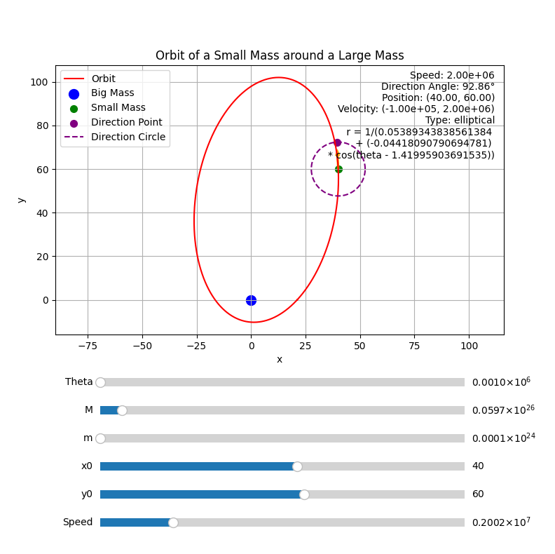
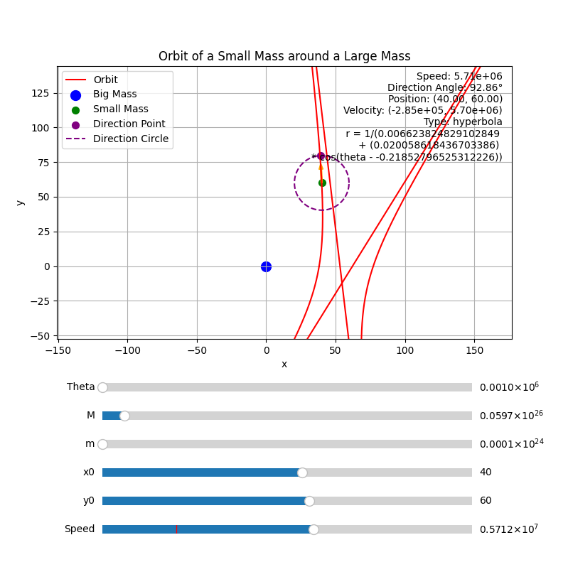

# 行星运动方程模拟器

这其实是我高中时候好奇算过的一个东西，现在就顺手写出来吧，顺带也能帮到一些朋友吧

相关博客：https://feipiao594.github.io/posts/d11d8f41.html

## 使用
**显示椭圆**

**显示双曲线**

如图，你可以拖动下面的条修改一些参数
其中 Theta 是指模拟点数，值越高，曲线越精细平滑，相应的也会越消耗性能
下方的 Speed 更改的是速度大小，而速度方向由拖动紫色小点达成

支持滚轮缩放，你也可以拖动绿色小点来修改小质量天体的位置